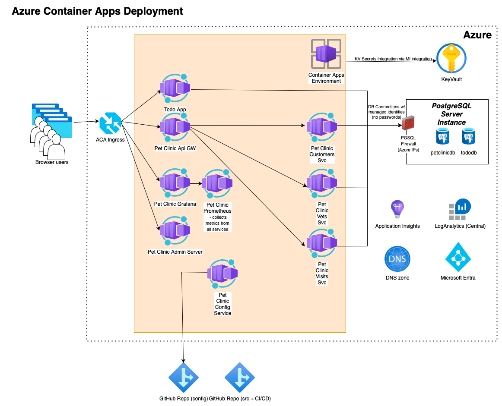

# Spring Boot Todo App and Pet Clinic App on Azure Container Apps (ACA)

## Deploying Todo App and Pet Clinic App into an ACA using az CLI and Azure Bicep templates



* Start the command line, clone the repo using ```git clone https://github.com/martinabrle/aca-java-demo.git``` and change your current directory to ```aca-java-demo/scripts``` directory:

    ```bash
    cd ./aca-java-demo/scripts
    ```

* Log in into Azure from the command line using ```az login``` ([link](https://docs.microsoft.com/en-us/cli/azure/authenticate-azure-cli))
* List available Azure subscriptions using ```az account list -o table``` ([link](https://docs.microsoft.com/en-us/cli/azure/account#az-account-list))
* Select an Azure subscription to deploy the infra into, using ```az account set -s 00000000-0000-0000-0000-000000000000```
  ([link](https://docs.microsoft.com/en-us/cli/azure/account#az-account-set)); replace ```00000000-0000-0000-0000-000000000000``` with Azure subscription Id you will deploy into
* Set environment variables:

    ```bash
    AZURE_LOCATION="switzerlandnorth" # <--azure region for deploying resources
    ACA_NAME="aca-java-demo"
    ACA_RESOURCE_GROUP="aca_java_demo_rg"
    PGSQL_NAME="{{{REPLACE_WITH_PGSQL_NAME}}}" # <--needs to be unique
    CONTAINER_REGISTRY_NAME="{{{REPLACE_WITH_APP_SERVICE_NAME}}}" # <--needs to be unique
    LOG_ANALYTICS_WRKSPC_NAME="{{{REPLACE_WITH_LOG_WORKSPACE_NAME}}}" # <--needs to be unique

    DBA_GROUP_NAME="All TEST PGSQL Admins" # <--Entra ID group of users with permissions to manage the PGSQL server
    DBA_GROUP_ID=`az ad group show --group "${DBA_GROUP_NAME}" --query '[id]' -o tsv`

    PET_CLINIC_GIT_CONFIG_REPO_URI="https://github.com/martinabrle/aks-java-demo-config" # <--URI of YOUR Git repository with Pet Clinic Java Spring Boot configurations
    PET_CLINIC_GIT_CONFIG_REPO_USERNAME="martinabrle" # <--Username to access the Git repository with Pet Clinic Java Spring Boot configurations - in this case my GH handle
    PET_CLINIC_GIT_CONFIG_REPO_PASSWORD="PAT_TOKEN" # <--Token to access the Git repository with Pet Clinic Java Spring Boot configurations

    TODO_APP_DB_NAME="todoappdb" # <--Name of the database for the Todo App
    PET_CLINIC_DB_NAME="petclinicdb" # <--Name of the database for the Pet Clinic App

    PET_CLINIC_CUSTS_SVC_DB_USER_NAME="custssvc" # <--Name of the user for the Pet Clinic Customers Service
    PET_CLINIC_VETS_SVC_DB_USER_NAME="vetssvc" # <--Name of the user for the Pet Clinic Vets Service
    PET_CLINIC_VISITS_SVC_DB_USER_NAME="visitssvc" # <--Name of the user for the Pet Clinic Visits Service
    ```

    Optionally, set the following environment variables to deploy with custom DNS zone:

    ```bash
    DNS_ZONE_NAME="aca-java-demo" # <--Name of the DNS zone of all services - here I expect to use DNS names like "aca-java-demo.petclinic.DEVELOPMENT_ENVI.MY_COMPANY_DOMAIN.com"
    PARENT_DNS_ZONE_NAME="DEVELOPMENT_ENVI.MY_COMPANY_DOMAIN.com" # <--Name of the parent DNS zone - here I expect to use DNS names like "aca-java-demo.petclinic.DEVELOPMENT_ENVI.MY_COMPANY_DOMAIN.com
    PARENT_DNS_SUBSCRIPTION_ID='00000000-0000-0000-0000-000000000000' # <--Subscription ID where the parent DNS zone is located
    PARENT_DNS_ZONE_RESOURCE_GROUP="{{{REPLACE_WITH_PARENT_DNS_ZONE_RESOURCE_GROUP}}}" # <--Resource group for the parent DNS zone
    PET_CLINIC_DNS_ZONE_NAME="petclinic" # <--Name of the subdomain where the Pet Clinic app will be deployed
    ```

    Optionally, you can set some or all of the following environment variables in order to tag resources and separate state (DBs, Log Analytics, container repository) and compute (ACA, managed identities, app insights,..) into different resource groups and/or subscriptions:

    ```bash
    ACA_RESOURCE_TAGS='{ \"Department\": \"RESEARCH\", \"CostCentre\": \"DEV\", \"DeleteNightly\": \"true\",  \"DeleteWeekly\": \"true\", \"Architecture\": \"ACA\" }' # <--Resource tags for the ACA resource group and all resources within
    
    LOG_ANALYTICS_WRKSPC_RESOURCE_GROUP="{{{REPLACE_WITH_LOG_WORKSPACE_RESOURCE_GROUP}}}" # <--Resource group for Log Abalytics Workspace
    LOG_ANALYTICS_WRKSPC_RESOURCE_TAGS='{ \"Department\": \"RESEARCH\", \"CostCentre\": \"DEV\", \"DeleteNightly\": \"true\",  \"DeleteWeekly\": \"true\", \"Architecture\": \"LOG-ANALYTICS\"}' # <--Resource tags for the Log Analytics resource group and all resources within
    LOG_ANALYTICS_WRKSPC_SUBSCRIPTION_ID='00000000-0000-0000-0000-000000000000' # <--Subscription ID where Log Analytics will be deployed
    
    
    PGSQL_RESOURCE_GROUP="{{{REPLACE_WITH_PGSQL_RESOURCE_GROUP}}}" # <--Resource group for Postgresql server
    PGSQL_RESOURCE_TAGS='{ \"Department\": \"RESEARCH\", \"CostCentre\": \"DEV\", \"DeleteNightly\": \"false\",  \"DeleteWeekly\": \"false\", \"Architecture\": \"PGSQL\"}' # <--Resource tags for the Postgresql resource group and all resources within
    PGSQL_SUBSCRIPTION_ID='00000000-0000-0000-0000-000000000000' # <--Subscription ID where PGSQL will be deployed

    
    CONTAINER_REGISTRY_RESOURCE_GROUP="{{{REPLACE_WITH_APP_SERVICE_RESOURCE_GROUP}}}"
    CONTAINER_REGISTRY_RESOURCE_TAGS='{ \"Department\": \"RESEARCH\", \"CostCentre\": \"DEV\", \"DeleteNightly\": \"false\",  \"DeleteWeekly\": \"false\", \"Architecture\": \"CONTAINER-REGISTRY\"}'
    CONTAINER_REGISTRY_SUBSCRIPTION_ID='00000000-0000-0000-0000-000000000000' # <--Subscription ID where the container registry will be deployed

    PARENT_DNS_ZONE_TAGS='{ \"Department\": \"RESEARCH\", \"CostCentre\": \"DEV\", \"DeleteNightly\": \"true\",  \"DeleteWeekly\": \"true\", \"Architecture\": \"DNS\" }' # <--Resource tags for the parent DNS zone, if you are deploying into a custom DNS zone
    

    DB_NAME="tododb"

    DB_USER_MI_NAME="todoapi"


    ```

    If you are aiming to integrate with your DNS inftrasructure, you can set the following environment variables:

    ```bash
    DNS_ZONE_NAME="aca-java-demo" # <--Name of the DNS zone of all services - here I expect to use DNS names like "aca-java-demo.petclinic.DEVELOPMENT_ENVI.MY_COMPANY_DOMAIN.com"
    PARENT_DNS_ZONE_NAME="{{{REPLACE_WITH_PARENT_DNS_ZONE_NAME}}}" # <--Name of the parent DNS zone
    PARENT_DNS_SUBSCRIPTION_ID='00000000-0000-0000-0000-000000000000' # <--Subscription ID where the parent DNS zone is located
    PARENT_DNS_ZONE_RESOURCE_GROUP="{{{REPLACE_WITH_PARENT_DNS_ZONE_RESOURCE_GROUP}}}" # <--Resource group for the parent DNS zone
    PET_CLINIC_DNS_ZONE_NAME="petclinic" # <--Name of the subdomain where the Pet Clinic app will be deployed
    ```

* Deploy resource groups for all services using a Bicep template - easier than typing in AZ CLI commands:

    ```bash
    az deployment sub create \
        -l "${AZURE_LOCATION}" \
        --template-file ./resource_groups.bicep \
        --parameters location="${secrets.AZURE_LOCATION}" \
                    acaRG="${ACA_RESOURCE_GROUP}" \
                    acaTags="${ACA_RESOURCE_TAGS}" \ # <--optional from here
                    containerRegistrySubscriptionId="${CONTAINER_REGISTRY_SUBSCRIPTION_ID}" \
                    containerRegistryRG="${CONTAINER_REGISTRY_RESOURCE_GROUP}" \
                    containerRegistryTags="${CONTAINER_REGISTRY_RESOURCE_TAGS}" \
                    pgsqlSubscriptionId="${PGSQL_SUBSCRIPTION_ID}" \
                    pgsqlRG="${PGSQL_RESOURCE_GROUP}" \
                    pgsqlTags="${PGSQL_RESOURCE_TAGS}" \
                    logAnalyticsSubscriptionId="${LOG_ANALYTICS_WRKSPC_SUBSCRIPTION_ID}" \
                    logAnalyticsRG="${LOG_ANALYTICS_WRKSPC_RESOURCE_GROUP}" \
                    logAnalyticsTags="${LOG_ANALYTICS_WRKSPC_RESOURCE_TAGS}"
    ```

* Deploy all services (and create both app's databases):

    ```bash
    az deployment group create \
        --resource-group ${ACA_RESOURCE_GROUP} \
        --template-file ./main.bicep \
        --parameters acaName="${ACA_NAME}" \
                     logAnalyticsName="${LOG_ANALYTICS_WRKSPC_NAME}" \
                     containerRegistryName="${CONTAINER_REGISTRY_NAME}" \
                     petClinicGitConfigRepoUri="${PET_CLINIC_GIT_CONFIG_REPO_URI}" \
                     petClinicGitConfigRepoUserName="${PET_CLINIC_GIT_CONFIG_REPO_USERNAME}" \
                     petClinicGitConfigRepoPassword="${PET_CLINIC_GIT_CONFIG_REPO_PASSWORD}" \
                     location="${AZURE_LOCATION}" \
                     acaTags="${ACA_RESOURCE_TAGS}" \ # <--optional from here
                     containerRegistrySubscriptionId="${CONTAINER_REGISTRY_SUBSCRIPTION_ID}" \
                     containerRegistryRG="${CONTAINER_REGISTRY_RESOURCE_GROUP}" \
                     containerRegistryTags="${CONTAINER_REGISTRY_RESOURCE_TAGS}" \
                     dnsZoneName="${DNS_ZONE_NAME}" \
                     parentDnsZoneName="${PARENT_DNS_ZONE_NAME}" \
                     parentDnsZoneSubscriptionId="${PARENT_DNS_SUBSCRIPTION_ID}" \
                     parentDnsZoneRG="${PARENT_DNS_ZONE_RESOURCE_GROUP}" \
                     parentDnsZoneTags="${PARENT_DNS_ZONE_TAGS}" \
                     petClinicDnsZoneName="${PET_CLINIC_DNS_ZONE_NAME}" \
                     pgsqlName="${PGSQL_NAME}" \
                     pgsqlAADAdminGroupName="${DBA_GROUP_NAME}" \
                     pgsqlAADAdminGroupObjectId="${dbaGroupId}" \
                     pgsqlSubscriptionId="${PGSQL_SUBSCRIPTION_ID}" \
                     pgsqlRG="${GSQL_RESOURCE_GROUP}" \
                     pgsqlTodoAppDbName="${TODO_APP_DB_NAME}" \
                     pgsqlPetClinicDbName="${PET_CLINIC_DB_NAME}" \
                     todoAppDbUserName="${TODO_APP_DB_USER_NAME}" \
                     petClinicCustsSvcDbUserName="${PET_CLINIC_CUSTS_SVC_DB_USER_NAME}" \
                     petClinicVetsSvcDbUserName="${PET_CLINIC_VETS_SVC_DB_USER_NAME}" \
                     petClinicVisitsSvcDbUserName="${PET_CLINIC_VISITS_SVC_DB_USER_NAME}" \
                     pgsqlTags="${PGSQL_RESOURCE_TAGS}" \
                     logAnalyticsSubscriptionId="${LOG_ANALYTICS_WRKSPC_SUBSCRIPTION_ID}" \
                     logAnalyticsRG="${LOG_ANALYTICS_WRKSPC_RESOURCE_GROUP}" \
                     logAnalyticsTags="${LOG_ANALYTICS_WRKSPC_RESOURCE_TAGS}"


    ```

* Build TODO APP container image and push it to the Azure Container Registry:

    ```bash
    cd ../todo
    az acr build --registry ${CONTAINER_REGISTRY_NAME} --image todo-app:latest .
    ```

* Get AKS credentials:
    ```
    az aks get-credentials --resource-group ${AKS_RESOURCE_GROUP} --name ${AKS_NAME}
    ```
* Deploy Namespaces:
    ```
    # display yaml with namespaces definition
    cat ./01-namespaces.yml
    # deploy namespaces
    kubectl apply -f ./01-namespaces.yml"
    ```
* Deploy Config Maps for Todo App:
    ```
    # display yaml with Todo App config map
    cat ./07a-config-map-todo-app.yml
    # deploy Todo App config map
    kubectl apply -f ./07a-config-map-todo-app.yml"
    ```
* Deploy Config Maps for Pet Clinic App:
    ```
    # display yaml with Pet Clinic config map
    cat ./07b-config-map-pet-clinic-app.yml
    # deploy Pet Clinic config map
    kubectl apply -f ./07b-config-map-pet-clinic-app.yml"
    ```
* Deploy role bindings for Todo App:
    ```
    # prepare and display yaml with role bindings for Todo App
    cat ./02a-rolebinding-todo.yml | TODO_APP_EDIT_AD_GROUP_ID=${TODO_APP_EDIT_AD_GROUP_ID} TODO_APP_VIEW_AD_GROUP_ID=${TODO_APP_VIEW_AD_GROUP_ID} envsubst > ./02a-rolebinding-todo.yml.tmp
    cat ./02a-rolebinding-todo.yml.tmp
    # deploy role bindings for Todo App
    kubectl apply -f ./02a-rolebinding-todo.yml.tmp"
    ```
* Deploy role bindings for Pet Clinic App:
    ```
    # prepare and display yaml with role bindings for Pet Clinic App
    cat ./02b-rolebinding-pet-clinic.yml | PET_CLINIC_APP_EDIT_AD_GROUP_ID=${PET_CLINIC_APP_EDIT_AD_GROUP_ID} PET_CLINIC_APP_VIEW_AD_GROUP_ID=${PET_CLINIC_APP_VIEW_AD_GROUP_ID} envsubst > ./02b-rolebinding-pet-clinic.yml.tmp
            cat ./02b-rolebinding-pet-clinic.yml.tmp
    # deploy role bindings for Pet Clinic App
    kubectl apply -f ./02b-rolebinding-pet-clinic.yml.tmp"
    ```
* Deploy Todo App KV Secrets manifest:
    ```
    cat ./04a-kv-secrets-todo-app.yml | KEYVAULT_NAME=${KEYVAULT_NAME} TODO_APP_CLIENT_ID=${TODO_APP_CLIENT_ID} TENANT_ID=${TENANT_ID} envsubst > ./04a-kv-secrets-todo-app.yml.tmp
    cat ./04a-kv-secrets-todo-app.yml.tmp
    kubectl apply -f ./04a-kv-secrets-todo-app.yml.tmp
    ```
* Deploy PET_CLINIC_APP General KV Secrets manifest
    ```
    cat ./04b-kv-secrets-pet-clinic-app.yml | KEYVAULT_NAME=${{env.KEYVAULT_NAME}} PET_CLINIC_APP_CLIENT_ID=${{env.PET_CLINIC_APP_CLIENT_ID}} TENANT_ID=${{env.TENANT_ID}} envsubst > ./04b-kv-secrets-pet-clinic-app.yml.tmp
    cat ./04b-kv-secrets-pet-clinic-app.yml.tmp
    kubectl apply -f ./04b-kv-secrets-pet-clinic-app.yml.tmp
    ```
* Deploy PET_CLINIC_CONFIG_SVC KV Secrets manifest
    ```
    cat ./04c-kv-secrets-pet-clinic-config-svc.yml | KEYVAULT_NAME=${{env.KEYVAULT_NAME}} CONFIG_SVC_CLIENT_ID=${{env.CONFIG_SVC_CLIENT_ID}} TENANT_ID=${{env.TENANT_ID}} envsubst > ./04c-kv-secrets-pet-clinic-config-svc.yml.tmp
    cat ./04c-kv-secrets-pet-clinic-config-svc.yml.tmp
    kubectl apply -f ./04c-kv-secrets-pet-clinic-config-svc.yml.tmp
    ```
* Deploy PET_CLINIC_CUSTS_SVC KV Secrets manifest
    ```
    cat ./04d-kv-secrets-pet-clinic-custs-svc.yml | KEYVAULT_NAME=${{env.KEYVAULT_NAME}} CUSTS_SVC_CLIENT_ID=${{env.CUSTS_SVC_CLIENT_ID}} TENANT_ID=${{env.TENANT_ID}} envsubst > ./04d-kv-secrets-pet-clinic-custs-svc.yml.tmp
    cat ./04d-kv-secrets-pet-clinic-custs-svc.yml.tmp
    kubectl apply -f ./04d-kv-secrets-pet-clinic-custs-svc.yml.tmp
    ```
* Deploy PET_CLINIC_VETS_SVC KV Secrets manifest
    ```
    cat ./04e-kv-secrets-pet-clinic-vets-svc.yml | KEYVAULT_NAME=${{env.KEYVAULT_NAME}} VETS_SVC_CLIENT_ID=${{env.VETS_SVC_CLIENT_ID}} TENANT_ID=${{env.TENANT_ID}} envsubst > ./04e-kv-secrets-pet-clinic-vets-svc.yml.tmp
    cat ./04e-kv-secrets-pet-clinic-vets-svc.yml.tmp
    kubectl apply -f ./04e-kv-secrets-pet-clinic-vets-svc.yml.tmp
    ```
* Deploy PET_CLINIC_VISITS_SVC KV Secrets manifest
    ```
    cat ./04f-kv-secrets-pet-clinic-visits-svc.yml | KEYVAULT_NAME=${{env.KEYVAULT_NAME}} VISITS_SVC_CLIENT_ID=${{env.VISITS_SVC_CLIENT_ID}} TENANT_ID=${{env.TENANT_ID}} envsubst > ./04f-kv-secrets-pet-clinic-visits-svc.yml.tmp
    cat ./04f-kv-secrets-pet-clinic-visits-svc.yml.tmp
    kubectl apply -f ./04f-kv-secrets-pet-clinic-visits-svc.yml.tmp
    ```
* Deploy TODO_APP workload identity manifest
    ```
    cat ./06a-workload-identity-todo-app.yml | TODO_APP_CLIENT_ID=${{env.TODO_APP_CLIENT_ID}} envsubst > ./06a-workload-identity-todo-app.yml.tmp
    cat ./06a-workload-identity-todo-app.yml.tmp
    kubectl apply -f ./06a-workload-identity-todo-app.yml.tmp
    ```
* Deploy PET_CLINIC_APP workload identity manifest
    ```
    cat ./06b-workload-identity-pet-clinic-app.yml | PET_CLINIC_APP_CLIENT_ID=${{env.PET_CLINIC_APP_CLIENT_ID}}  envsubst > ./06b-workload-identity-pet-clinic-app.yml.tmp
    cat ./06b-workload-identity-pet-clinic-app.yml.tmp
    kubectl apply -f ./06b-workload-identity-pet-clinic-app.yml.tmp
    ```
* Deploy PET_CLINIC_CONFIG_SVC workload identity manifest
    ```
    cat ./06c-workload-identity-pet-clinic-config-svc.yml | CONFIG_SVC_CLIENT_ID=${{env.CONFIG_SVC_CLIENT_ID}} envsubst > ./06c-workload-identity-pet-clinic-config-svc.yml.tmp
    cat ./06c-workload-identity-pet-clinic-config-svc.yml.tmp
    kubectl apply -f ./06c-workload-identity-pet-clinic-config-svc.yml.tmp
    ```
* Deploy PET_CLINIC_CUSTS_SVC workload identity manifest
    ```
    kubectl apply -f ./06d-workload-identity-pet-clinic-custs-svc.yml.tmp
    ```
* Deploy PET_CLINIC_VETS_SVC workload identity manifest
    ```
    kubectl apply -f ./06e-workload-identity-pet-clinic-vets-svc.yml.tmp
    ```
* Deploy PET_CLINIC_VISITS_SVC workload identity manifest
    ```
    cat ./06f-workload-identity-pet-clinic-visits-svc.yml | VISITS_SVC_CLIENT_ID=${{env.VISITS_SVC_CLIENT_ID}} envsubst > ./06f-workload-identity-pet-clinic-visits-svc.yml.tmp
    cat ./06f-workload-identity-pet-clinic-visits-svc.yml.tmp
    kubectl apply -f ./06f-workload-identity-pet-clinic-visits-svc.yml.tmp
    ```

* Create federated identity for Todo App
    ```
    export SERVICE_ACCOUNT_NAMESPACE="todo"
    export SERVICE_ACCOUNT_NAME="todo-app-service-account"
    export AKS_OIDC_ISSUER="$(az aks show --resource-group ${AKS_RESOURCE_GROUP} --name ${AKS_NAME} --query "oidcIssuerProfile.issuerUrl" -o tsv)"
    echo "AKS_OIDC_ISSUER: $AKS_OIDC_ISSUER"
    az identity federated-credential create --name ${FEDERATED_IDENTITY_NAME} --identity-name ${TODO_APP_MI_NAME} --resource-group ${AKS_RESOURCE_GROUP} --issuer ${AKS_OIDC_ISSUER} --subject system:serviceaccount:${SERVICE_ACCOUNT_NAMESPACE}:${SERVICE_ACCOUNT_NAME} --audience api://AzureADTokenExchange
    ```
* Create federated identity for Pet Clinic App (generic service account used by majority of microservices)
    ```
    export SERVICE_ACCOUNT_NAMESPACE="pet-clinic"
    export SERVICE_ACCOUNT_NAME="pet-clinic-app-service-account"
    export AKS_OIDC_ISSUER="$(az aks show --resource-group ${AKS_RESOURCE_GROUP} --name ${AKS_NAME} --query "oidcIssuerProfile.issuerUrl" -o tsv)"
    echo "AKS_OIDC_ISSUER: $AKS_OIDC_ISSUER"
    az identity federated-credential create --name ${FEDERATED_IDENTITY_NAME} --identity-name ${PET_CLINIC_APP_MI_NAME} --resource-group ${AKS_RESOURCE_GROUP} --issuer ${AKS_OIDC_ISSUER} --subject system:serviceaccount:${SERVICE_ACCOUNT_NAMESPACE}:${SERVICE_ACCOUNT_NAME} --audience api://AzureADTokenExchange
    ```
* Create federated identity for Pet Clinic Config Service
    ```
    export SERVICE_ACCOUNT_NAMESPACE="pet-clinic"
    export SERVICE_ACCOUNT_NAME="pet-clinic-config-service-account"
    export AKS_OIDC_ISSUER="$(az aks show --resource-group ${AKS_RESOURCE_GROUP} --name ${AKS_NAME} --query "oidcIssuerProfile.issuerUrl" -o tsv)"
    echo "AKS_OIDC_ISSUER: $AKS_OIDC_ISSUER"
    az identity federated-credential create --name ${FEDERATED_IDENTITY_NAME} --identity-name ${PET_CLINIC_CONFIG_SVC_MI_NAME} --resource-group ${AKS_RESOURCE_GROUP} --issuer ${AKS_OIDC_ISSUER} --subject system:serviceaccount:${SERVICE_ACCOUNT_NAMESPACE}:${SERVICE_ACCOUNT_NAME} --audience api://AzureADTokenExchange
    ```
* Create federated identity for Pet Clinic Customers Service
    ```
    export SERVICE_ACCOUNT_NAMESPACE="pet-clinic"
    export SERVICE_ACCOUNT_NAME="pet-clinic-custs-service-account"
    export AKS_OIDC_ISSUER="$(az aks show --resource-group ${AKS_RESOURCE_GROUP} --name ${AKS_NAME} --query "oidcIssuerProfile.issuerUrl" -o tsv)"
    echo "AKS_OIDC_ISSUER: $AKS_OIDC_ISSUER"
    az identity federated-credential create --name ${FEDERATED_IDENTITY_NAME} --identity-name ${PET_CLINIC_CUSTS_SVC_MI_NAME} --resource-group ${AKS_RESOURCE_GROUP} --issuer ${AKS_OIDC_ISSUER} --subject system:serviceaccount:${SERVICE_ACCOUNT_NAMESPACE}:${SERVICE_ACCOUNT_NAME} --audience api://AzureADTokenExchange
    ```
* Create federated identity for Pet Clinic Vets Service
    ```
    export SERVICE_ACCOUNT_NAMESPACE="pet-clinic"
    export SERVICE_ACCOUNT_NAME="pet-clinic-vets-service-account"
    export AKS_OIDC_ISSUER="$(az aks show --resource-group ${AKS_RESOURCE_GROUP} --name ${AKS_NAME} --query "oidcIssuerProfile.issuerUrl" -o tsv)"
    echo "AKS_OIDC_ISSUER: $AKS_OIDC_ISSUER"
    az identity federated-credential create --name ${FEDERATED_IDENTITY_NAME} --identity-name ${PET_CLINIC_VETS_SVC_MI_NAME} --resource-group ${AKS_RESOURCE_GROUP} --issuer ${AKS_OIDC_ISSUER} --subject system:serviceaccount:${SERVICE_ACCOUNT_NAMESPACE}:${SERVICE_ACCOUNT_NAME} --audience api://AzureADTokenExchange
    ```
* Create federated identity for Pet Clinic Visits Service
    ```
    export SERVICE_ACCOUNT_NAMESPACE="pet-clinic"
    export SERVICE_ACCOUNT_NAME="pet-clinic-visits-service-account"
    export AKS_OIDC_ISSUER="$(az aks show --resource-group ${AKS_RESOURCE_GROUP}} --name ${AKS_NAME} --query "oidcIssuerProfile.issuerUrl" -o tsv)"
    echo "AKS_OIDC_ISSUER: $AKS_OIDC_ISSUER"
    az identity federated-credential create --name ${FEDERATED_IDENTITY_NAME} --identity-name ${PET_CLINIC_VISITS_SVC_MI_NAME} --resource-group ${AKS_RESOURCE_GROUP} --issuer ${AKS_OIDC_ISSUER} --subject system:serviceaccount:${SERVICE_ACCOUNT_NAMESPACE}:${SERVICE_ACCOUNT_NAME} --audience api://AzureADTokenExchange
    ```


* Change your current directory to ```aks-java-demo/todo```:
    ```
    cd ../todo
    ```
* Build the app using
    ```
    ./mvnw clean
    ```
    and
    ```
    PORT=9901
    ./mvnw -B package
    ```
* You can deploy the generated .jar package either using Maven or AZ command-line-utility (CLI):
    * Maven:
        * Configure the application with Maven Plugin:
            ```
            ./mvnw com.microsoft.azure:azure-webapp-maven-plugin:2.2.0:config
            ```
            This maven goal will first authenticate with Azure and than it will ask you which App Service (or in other words, which Java WebApp) do you want to deploy the app into. Confirm the selection and you will find an updated configuration in your application project's ```pom.xml```.
        * Deploy the application:
             ```
             ./mvnw azure-webapp:deploy
             ```
    * AZ CLI:
        ``` 
        az webapp deploy --resource-group $APP_SERVICE_RESOURCE_GROUP --name $APP_SERVICE_NAME --slot staging --type jar --src-path ./target/todo-0.0.1.jar
        ```

* Open the app's URL (```https://${APP_SERVICE_NAME}.azurewebsites.net/```) in the browser and test it by creating and reviewing tasks
* Explore the SCM console on (```https://${APP_SERVICE_NAME}.scm.azurewebsites.net/```); check logs and bash options
* Review an AppService configuration to see that no App Password is being used
* Delete previously created resources using ```az group delete -n $APP_SERVICE_RESOURCE_GROUP``` ([link](https://docs.microsoft.com/en-us/cli/azure/group?view=azure-cli-latest#az-group-delete))
* If you created a new Log Analytics Workspace, delete it using  ```az group delete -n $LOG_ANALYTICS_WRKSPC_RESOURCE_GROUP``` ([link](https://docs.microsoft.com/en-us/cli/azure/group?view=azure-cli-latest#az-group-delete))
